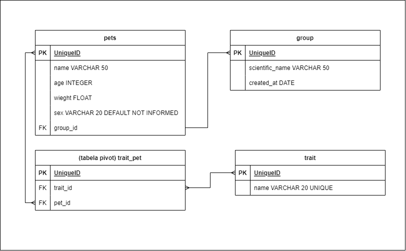

# M5 - Pet Kare

Nesse projeto, exercitamos o conteúdo aprendido de Django para desenvolver uma API que gerencia cadastro de pets e suas características.
Link do Deploy da aplicação feito no RailWay - <a href="https://m5-bandkamp-annekarolle-production.up.railway.app/ ">https://m5-bandkamp-annekarolle-production.up.railway.app/ </a>. 

## Diagrama de Classe

URL - <a href="https://drive.google.com/file/d/1MOcVGDLl3uWbnw8CWAPfms7OhFaHPvfJ/view?usp=share_link">Clique Aqui e confira!</a>

## Tecnologias

